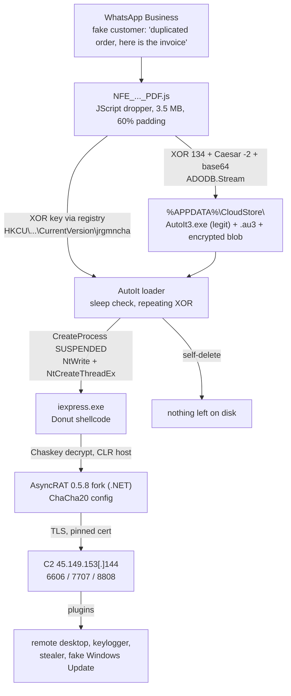

# Fake NF-e Invoice Phishing on WhatsApp → AsyncRAT: Malware Analysis (JScript, AutoIt, Donut, ChaCha20)

[](https://www.first.org/tlp/)
[](#mitre-attck-mapping)
[](detection/)
[](LICENSE)
[](https://creativecommons.org/licenses/by/4.0/)

Static malware analysis of a **fake Brazilian electronic invoice (NF-e)** sent over **WhatsApp Business** to an e-commerce seller. The "invoice" `NFE_…_PDF.js` is a **JScript (WSH) dropper** that drops a legitimate **AutoIt** interpreter, injects **Donut** shellcode into `iexpress.exe` and loads an **AsyncRAT 0.5.8 fork** in memory. The fork replaces AsyncRAT's AES with **ChaCha20** and adds a **fake Windows Update screen** that hides hands-on banking fraud from the victim.

Includes the full infection chain, decrypted C2 config, **IOCs**, tested **YARA** and **Sigma** rules, a static **config extractor**, a **MITRE ATT&CK** mapping and incident-response steps.

🇧🇷 **Versão em português (golpe da nota fiscal falsa no WhatsApp):** [README.pt-BR.md](README.pt-BR.md)

> **No malware in this repository.** Only analysis, indicators and detection content. See [SECURITY.md](SECURITY.md).

---

## TL;DR

| | |
|---|---|
| **Lure** | WhatsApp "customer" claims a duplicated order and sends "the invoice" (`NFE_7482594_0938402947928387421_PDF.js`, 3.6 MB) |
| **Platform** | Windows only. Android, iOS, macOS and Linux cannot run it (verified) |
| **Final payload** | AsyncRAT 0.5.8 fork, in memory inside `iexpress.exe`, ChaCha20-encrypted config |
| **C2** | `dhdxhdhdhd[.]duckdns[.]org`, `uhdyadasud[.]duckdns[.]org` → `45.149.153[.]144`, TCP 6606/7707/8808 (TLS) |
| **Impact** | Full remote control via plugins (screen, keylogger, password theft), plus a capture-proof fake update overlay that locks keyboard and mouse during fraud |
| **Analyzed** | 2026-10-01, statically; no Windows execution |

## Infection chain



## Documentation

| Page | Contents |
|---|---|
| [01. Infection chain](docs/01-infection-chain.md) | WhatsApp pretext, JS dropper deobfuscation, AutoIt injector, Donut shellcode |
| [02. AsyncRAT config and ChaCha20](docs/02-asyncrat-config-chacha20.md) | Identifying ChaCha20 from .NET IL without a decompiler; full decrypted config |
| [03. Capabilities](docs/03-capabilities-fake-windows-update.md) | Commands, plugins, the fake Windows Update overlay (`WDA_EXCLUDEFROMCAPTURE`), persistence options |
| [04. Detection and response](docs/04-detection-and-response.md) | Blocking, hunting queries, incident response, prevention, where to report |
| [Lessons learned](docs/lessons-learned.md) | For businesses and for analysts |

## Indicators of compromise

Full machine-readable list: [`iocs/iocs.csv`](iocs/iocs.csv).

| Type | Value |
|---|---|
| SHA-256 (dropper) | `ee479f0b931765f95731ef57ce60e2b0aab68e40c00794d3f186e34bc7ca8bb6` |
| SHA-256 (AutoIt loader) | `c1ac8a0f1b5413bcf56964d3e9f8bcc3a15c0a7ac51c46a7f0dc4a6a4ca724d7` |
| SHA-256 (AsyncRAT client) | `f1af1eca83ae34979f95fdd822b349213df9323bda7ab344595820f6afacf518` |
| Domain | `dhdxhdhdhd[.]duckdns[.]org` |
| Domain | `uhdyadasud[.]duckdns[.]org` |
| IPv4 | `45.149.153[.]144` (resolved 2026-10-01) |
| Ports | 6606, 7707, 8808 / TCP (TLS) |
| TLS cert | `CN=Server`, SHA-1 `E3C5A7712CE7565835F39C1874F9C4A294F10061` |
| Mutex | `HquPKsyB1gUp` |
| Registry | `HKCU\Software\Microsoft\Windows\CurrentVersion\jrgmncha` → `xvmotf` |
| Path | `%APPDATA%\CloudStore\` (`hukdrtqp.exe`, `zgmnikcw.au3`, `plçda`) |

## MITRE ATT&CK mapping

| Tactic | Technique | Evidence |
|---|---|---|
| Initial Access | T1566.003 Spearphishing via Service | Fake customer on WhatsApp Business |
| Execution | T1204.002 User Execution: Malicious File | Victim opens `…_PDF.js` |
| Execution | T1059.007 JavaScript | WSH JScript dropper |
| Execution | T1059.010 AutoHotKey & AutoIT | Legit AutoIt3.exe runs the `.au3` loader |
| Defense Evasion | T1036 Masquerading | `_PDF` name, fake Oracle/DigiCert banner |
| Defense Evasion | T1027.001 Binary Padding | ~2 MB of unused base64 and junk code |
| Defense Evasion | T1027.009 Embedded Payloads | Three payloads embedded in the script |
| Defense Evasion | T1140 Deobfuscate/Decode | XOR, Caesar, base64, Donut, ChaCha20 |
| Defense Evasion | T1112 Modify Registry | XOR key stored in HKCU, then deleted |
| Defense Evasion | T1497.003 Time Based Evasion | `Sleep(5153)` + `TimerDiff` check |
| Defense Evasion | T1055 Process Injection | Suspended `iexpress.exe` + `NtCreateThreadEx` |
| Defense Evasion | T1620 Reflective Code Loading | Donut loads the .NET client in memory |
| Defense Evasion | T1564.003 Hidden Window | `Run(..., 0)`, `CREATE_NO_WINDOW` |
| Defense Evasion | T1070.004 File Deletion | Drop removes itself |
| Discovery | T1082, T1033, T1518.001, T1010 | OS, user, antivirus (WMI), active window |
| Command and Control | T1573.002 Asymmetric Cryptography | TLS with pinned server certificate |
| Command and Control | T1571 Non-Standard Port | 6606, 7707, 8808 |
| Command and Control | T1105 Ingress Tool Transfer | Plugins pushed by the operator |
| Persistence (optional) | T1053.005, T1547.001 | `schtasks` on logon / Run key (disabled in this sample) |
| Persistence (optional) | T1176 Browser Extensions | `ExtensionInstallForcelist` (disabled in this sample) |

## Detection content

| File | What it catches | Tested |
|---|---|---|
| [`detection/yara/nfe_asyncrat_chain.yar`](detection/yara/nfe_asyncrat_chain.yar) | JS dropper, AutoIt injector, AsyncRAT ChaCha20 fork | Each rule hits only its stage; 0 false positives on 30,309 benign files |
| [`detection/sigma/…au3_from_appdata_via_wsh.yml`](detection/sigma/proc_creation_win_autoit_au3_from_appdata_via_wsh.yml) | WSH → AutoIt from AppData; argument-less `iexpress.exe` from AppData | Syntax-checked |
| [`tools/asyncrat_chacha_config.py`](tools/asyncrat_chacha_config.py) | Extracts and decrypts the config from the .NET client (no execution, JSON output) | Recovers key and all values from the sample |

## Repository layout

```
├── docs/                  analysis write-up (start at 01)
├── iocs/iocs.csv          machine-readable indicators
├── detection/yara/        YARA rules
├── detection/sigma/       Sigma rules (process creation)
├── tools/                 static config extractor (Python, dnfile)
├── README.pt-BR.md        Portuguese summary for Brazilian businesses
└── SECURITY.md            safety and responsible-use notes
```

## Methodology

Static analysis in an isolated, disposable Linux container: Python (custom decoders), [donut-decryptor](https://github.com/volexity/donut-decryptor), [dnfile](https://github.com/malwarefrank/dnfile), [dncil](https://github.com/mandiant/dncil), [yara-python](https://github.com/VirusTotal/yara-python) and OpenSSL. The only execution was the dropper under Node.js, to show it fails outside Windows. No connection was made to the attacker's infrastructure beyond a DNS lookup. AI-assisted (Claude Code); every finding was verified against the disassembled code. See [lessons learned](docs/lessons-learned.md#on-ai-assisted-analysis).

## Disclaimer

For defensive, educational and research purposes. Indicators reflect what was observed on 2026-10-01 and may since have been reassigned to unrelated parties. Do not interact with the listed infrastructure.

## Author

**Max Haider** · [maxhaider.dev](https://maxhaider.dev) · [@maxh33](https://github.com/maxh33)

Found it useful? Star the repo, share it with someone who handles invoices on WhatsApp, or open an issue with new samples' hashes (never the samples themselves).
